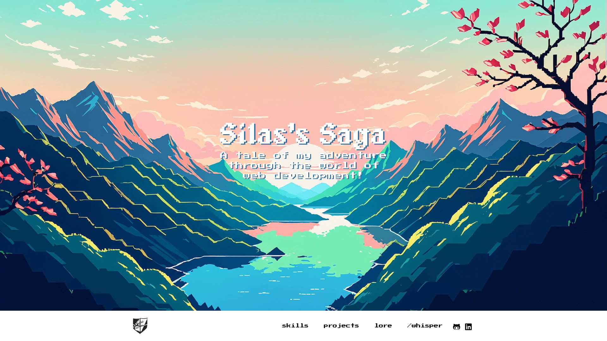
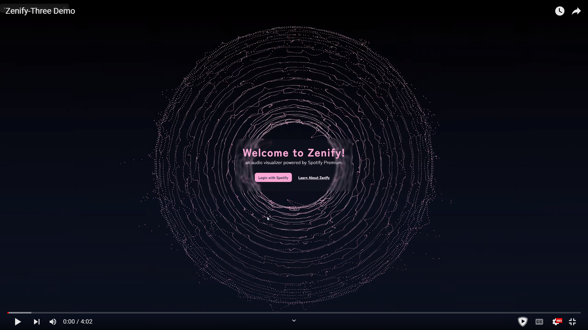

# 🐱‍💻 Silas Cundiff

**`Digital Creator - Developer & Designer`**

I'm a full-stack developer and designer, with a love for exercising my creativity to build unique websites, apps, and games! Projects found here are built by me from the ground up, all the way from idea, to design, to launch! 🚀

Learn more at [SilasCundiff.com](https://silascundiff.com)

---

## 🔧 My most used tools and languages

---

New Portfolio site coming soon! View progress [here](https://github.com/SilasCundiff/SilasCundiff2024)

Inspired by my love of games, it will feature several sections that behave like different UIs from different games!

Checkout my most recent app, a Spotify Audio Visualizer built with Nextjs, Three, and the Spotify API
[Zenify](https://zenify.silascundiff.com/)
[Repo Link](https://github.com/SilasCundiff/zenify-three)

Contact Me ✉
Silas Cundiff - <Silvanusdesigns@gmail.com.com>
